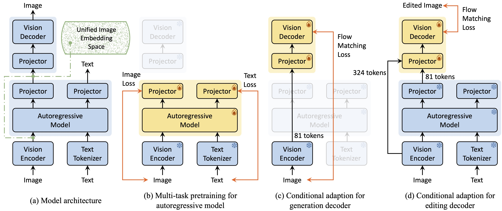

<p align="center">
    <br>
    
    <br>
<p>
<h1 align="center">Nexus-Gen: A Unified Model for Image Understanding, Generation, and Editing</h1>
 
<div align="center">

  <a href="http://arxiv.org/abs/2504.21356"></a> &ensp;
  <a href="https://www.modelscope.cn/models/DiffSynth-Studio/Nexus-Gen"></a> &ensp;
  <a href="https://huggingface.co/modelscope/Nexus-Gen"></a> &ensp;
  <a href="https://www.modelscope.cn/studios/DiffSynth-Studio/Nexus-Gen"></a> &ensp;

</div>

## News
- **July 11, 2025**: **[Nexus-Gen V2](https://www.modelscope.cn/models/DiffSynth-Studio/Nexus-GenV2) is released**. [Technical report](http://arxiv.org/abs/2504.21356) will be updated soonly. The model is opitimized from the following aspects:
  - Better image understanding capbility (**45.7 on [MMMU](https://github.com/MMMU-Benchmark/MMMU)**) through optimization on training schedules.
  - Better image generation (**0.81 on [GenEval](https://github.com/djghosh13/geneval.git)**) robustness through training with long-short caption.
  - Better reconstruction in image editing tasks. We have proposed a better editing decoder for Nexus-Gen.
  - Support generation and editing with Chinese prompts.
- **May 27, 2025**: We fine-tuned Nexus-Gen using the [BLIP-3o-60k](https://huggingface.co/datasets/BLIP3o/BLIP3o-60k) dataset, significantly improving the model's robustness to text prompts in image generation, **achieving a GenEval score of 0.79**. The [model checkpoints](https://www.modelscope.cn/models/DiffSynth-Studio/Nexus-Gen) have been updated.

## What is Nexus-Gen
Nexus-Gen is a unified model that synergizes the language reasoning capabilities of LLMs with the image synthesis power of diffusion models. We propose a unified image embedding spaces to model image understanding, generation and editing tasks. To perform joint optimization across multiple tasks, we curate a large-scale dataset of 26.3 million samples and train Nexus-Gen using a multi-stage strategy, which includes the multi-task pretraining of the autoregressive model and conditional adaptations of the generation and editing decoders. 




## Model Inference
### Installation
```shell
# 1. Install [DiffSynth-Studio](https://github.com/modelscope/DiffSynth-Studio.git) from source
git clone https://github.com/modelscope/DiffSynth-Studio.git
cd DiffSynth-Studio
pip install -e .

# 2. Install requirements
pip install -r requirements.txt

# 3. Install ms-swift if you want to perform finetuning on Nexus-Gen.
pip install ms-swift==3.3.0.dev0
```

### Prepare models
Nexus-Gen adopts Qwen2.5-VL-Instruct 7B as its autoregressive model, and adopts FLUX.1-Dev as the vision decoders (including the generation decoder and editing decoder). You can run the following scripts to download the checkpoints.
```shell
python download_models.py
```
### Image Understanding
Nexus-Gen inheret the image understanding ability of Qwen2.5-VL. Try the following script (Needs at least 17 GB VRAM).
```shell
python image_understanding.py --input_image assets/examples/cat.png --instruction "Please give a brief description of the image"
```

### Image Generation
Try the following scripts to perform image generation (Needs at least 24 GB VRAM). Please see `image_generation.py` for details about the inference hyperparameters.
```shell
python image_generation.py --prompt "A cute cat" --width 512 --height 512
```
Nexus-GenV2 supports generation with chinese prompts. You may further set the Chinese template for image generation by setting `--language zh` as follows.
```shell
python image_generation.py --prompt "一只可爱的猫" --language zh --width 1024 --height 1024
```
### Image Editing
The Nexus-Gen model comprises two decoders: a generation decoder and an editing decoder (recommended). The former directly utilizes the 81-dimensional embeddings output by the autoregressive model to generate images, while the latter additionally incorporates the original image's 324-dimensional embeddings, enabling more accurate reconstruction of unedited regions in the image.

Try the follow script to perform image editing with editing decoder.
```shell
python image_editing.py --input_image assets/examples/cat.png  --instruction "Add a pair of sunglasses"
```

When performing large-region image edits such as conceptual modifications, it is recommended to employ the generation decoder. This approach allows the model's image generation capabilities to directly enhance its editing performance. Try the follow script to perform image editing with generation decoder.
```shell
python image_editing.py --input_image assets/examples/cat.png  --instruction "The cat is now running in a forest." --use_generation_decoder
```

Nexus-Gen also supports image editing using Chinese prompts:
```shell
python image_editing.py --input_image assets/examples/cat.png  --instruction "给猫加一副太阳镜"
```
Please see `image_editing.py` for details about the inference hyperparameters.
### Gradio demo
Try Nexus-Gen with a gradio UI:
```shell
python app.py
```

## Model training
We train Nexus-Gen using a multi-stage strategy, which includes the multi-task pretraining of the autoregressive model and conditional adaptations of the generation and editing decoders. The unified message-like dataset format is:
```json
"images": ["xxx.jpg", "xxx.jpg"]
"messages": [
    {"role": "user", "content": "<image> xxx"}, 
    {"role": "assistant", "content": "xxx"},
    {"role": "user", "content": "xxx"},
    {"role": "assistant", "content": "xxx <image>"}
]
```
See `assets/example_datasets` for more examples.
### 1. Multi-task pretraining for autoregressive model
The autoregressive model of Nexus-Gen is trained on image understanding, generation and editing tasks using [ms-swift](https://github.com/modelscope/ms-swift.git) framework. Please refer to `assets/example_datasets/llm_dataset.jsonl` for the example dataset.

Run the following script to perform finetuning on Nexus-Gen V2. Refer to the script for more configurations.
```shell
bash train/scripts/train_autoregressive_model.sh
```

If you would like to train the autoregressive model from sctrach, just replace the checkpoints of Nexus-Gen V2 with that of Qwen2.5-VL-7B-Instruct. Specially, replace the `*.safetensors` and `models/Nexus-GenV2/model.safetensors.index.json` files.

### 2. Conditional adaptation for generation decoder
Generation decoder is trained by image reconstruction with the 81-token image embeddings. There are two steps to train it.

(1) Prepare for the embedding-image dataset: given the message-like dataset `assets/example_datasets/gen_decoder_dataset.jsonl`, run the following code to pre-calculate the embeddings for each image and get the embed-like dataset `assets/example_datasets/embeds_gen/gen_decoder_embeds_dataset.jsonl`
```python
python train/utils/prepare_embeddataset_for_gen.py
```
(2) Train the generation decoder: run the following script to train generation decoder.
```shell
bash train/scripts/train_generation_decoder.sh
```
Please refer to `train/configs/generation_decoder.yaml` for detailed configurations.

### 3. Conditional adaptation for editing decoder
Editing decoder is trained on the ImagePulse dataset. There are two steps to train it.
(1) Prepare for the embedding-image dataset: given the message-like dataset `assets/example_datasets/edit_decoder_dataset.jsonl`, run the following code to pre-calculate the embeddings for the source and target images and get the embed-like dataset `assets/example_datasets/embeds_edit/edit_decoder_embeds_dataset.jsonl`
```python
PYTHONPATH=$(pwd) python train/utils/prepare_embeddataset_for_edit.py
```
(2) Train the editing decoder: run the following script to train editing decoder.
```shell
bash train/scripts/train_editing_decoder.sh
```
Please refer to `train/configs/editing_decoder.yaml` for detailed configurations. Please note that the projector of editing decoder includes a transformer layer, which is initialized from Qwen2.5-VL-7B-Instruct. So it is nessary to download the checkpoints to `models/Qwen/Qwen2.5-VL-7B-Instruct`:
```shell
modelscope download --model Qwen/Qwen2.5-VL-7B-Instruct --local_dir models/Qwen/Qwen2.5-VL-7B-Instruct
```
## Training Datasets
To be published.

## Qualitative results of Nexus-Gen


### Citation
```
@misc{zhang2025nexusgenunifiedmodelimage,
      title={Nexus-Gen: A Unified Model for Image Understanding, Generation, and Editing}, 
      author={Hong Zhang and Zhongjie Duan and Xingjun Wang and Yuze Zhao and Weiyi Lu and Zhipeng Di and Yixuan Xu and Yingda Chen and Yu Zhang},
      year={2025},
      eprint={2504.21356},
      archivePrefix={arXiv},
      primaryClass={cs.CV},
      url={https://arxiv.org/abs/2504.21356v2}, 
}
```