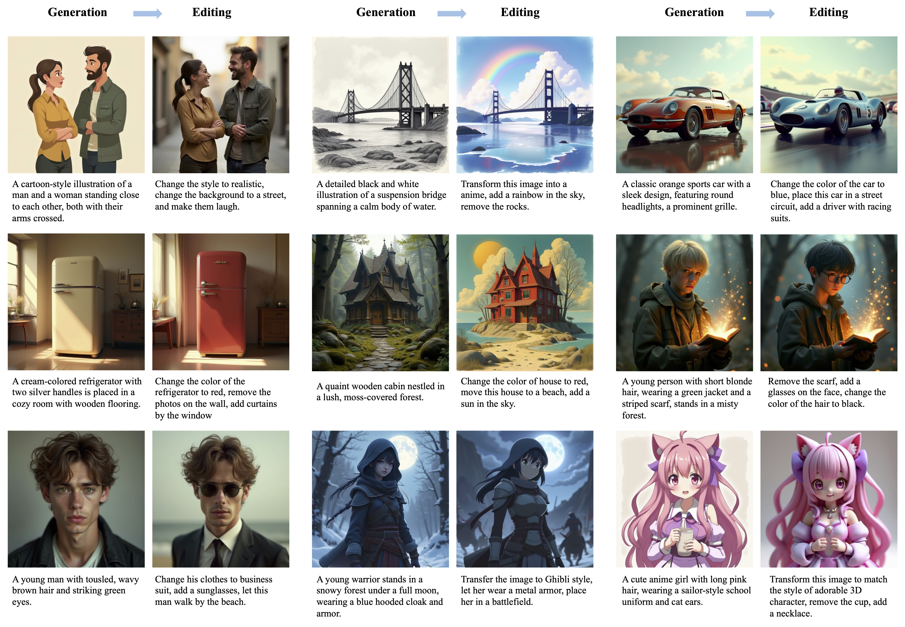
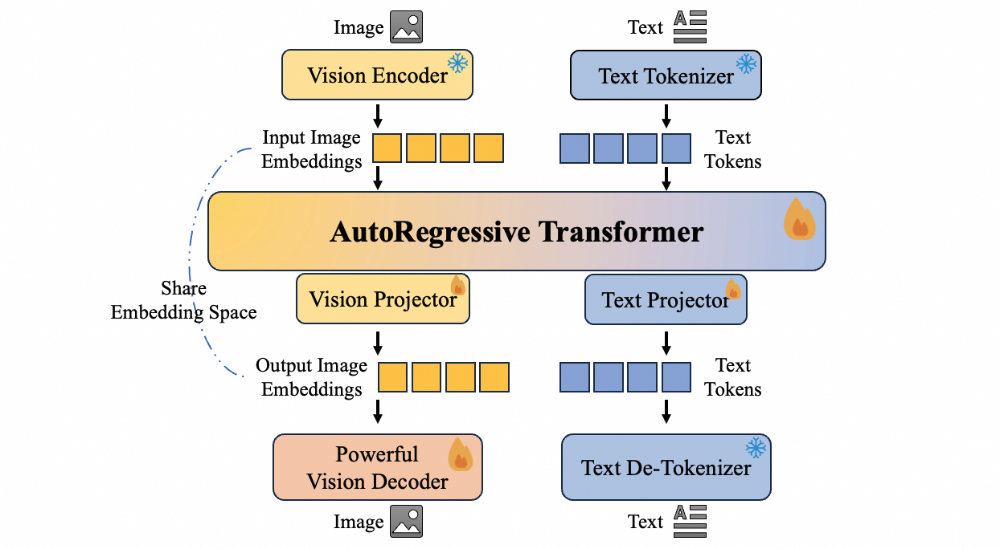

<h1 align="center">Nexus-Gen: A Unified Model for Image Understanding, Generation, and Editing</h1>
 
<div align="center">

  <a href="http://arxiv.org/abs/2504.21356"></a> &ensp;
  <a href="https://www.modelscope.cn/models/DiffSynth-Studio/Nexus-Gen"></a> &ensp;
  <a href="https://huggingface.co/modelscope/Nexus-Gen"></a> &ensp;
</div>

## TODO
- [x] Release the train and inference code.
- [x] Release the model checkpoint.
- [x] Release the technical report.
- [ ] Release the training datasets.

## What is Nexus-Gen
Nexus-Gen is a unified model that synergizes the language reasoning capabilities of LLMs with the image synthesis power of diffusion models. To align the embedding space of the LLM and diffusion model, we conduct a dual-phase alignment training process. (1) The autoregressive LLM learns to predict image embeddings conditioned on multimodal inputs, while (2) the vision decoder is trained to reconstruct high-fidelity images from these embeddings. During training the LLM, we identified a critical discrepancy between the autoregressive paradigm's training and inference phases, where error accumulation in continuous embedding space severely degrades generation quality. To avoid this issue, we introduce a prefilled autoregression strategy that prefills input sequence with position-embedded special tokens instead of continuous embeddings. Through dual-phase training, Nexus-Gen has developed the integrated capability to comprehensively address the image understanding, generation and editing tasks as follows.



## Getting Started
### Installation
1. Install [DiffSynth-Studio](https://github.com/modelscope/DiffSynth-Studio.git) from source:
```shell
git clone https://github.com/modelscope/DiffSynth-Studio.git
cd DiffSynth-Studio
pip install -e .
```
2. Install requirements
```
pip install -r requirements.txt
```
3. Install [ms-swift](https://github.com/modelscope/ms-swift.git) if you want to perform finetuning on Nexus-Gen.
```
pip install ms-swift -U
```
### Prepare models
```shell
python download_models.py
```
### Image Understanding
```shell
python image_understanding.py
```

### Image Generation
image generation with detailed prompt.
```shell
python image_generation.py
```
Polish prompt and generate images with Nexus-Gen.
```shell
image_generation_with_selfpolish.py
```

### Image Editing
```shell
python image_editing.py
```

### Gradio demo
```shell
python app.py
```

### Training Codes
Nexus-Gen is trained base on [ms-swift](https://github.com/modelscope/ms-swift.git) and [DiffSynth-Studio](https://github.com/modelscope/DiffSynth-Studio.git). You can find the training scripts in `train/scripts/train_decoder.sh` and `train_llm.sh`.

### Citation
```
@article{zhang2025nexus-gen,
      title={Nexus-Gen: A Unified Model for Image Understanding, Generation, and Editing}, 
      author={Hong Zhang and Zhongjie Duan and Xingjun Wang and Yingda Chen and Yuze Zhao and Yu Zhang},
      journal={arXiv preprint arXiv:2504.21356},
      year={2025}
}
```